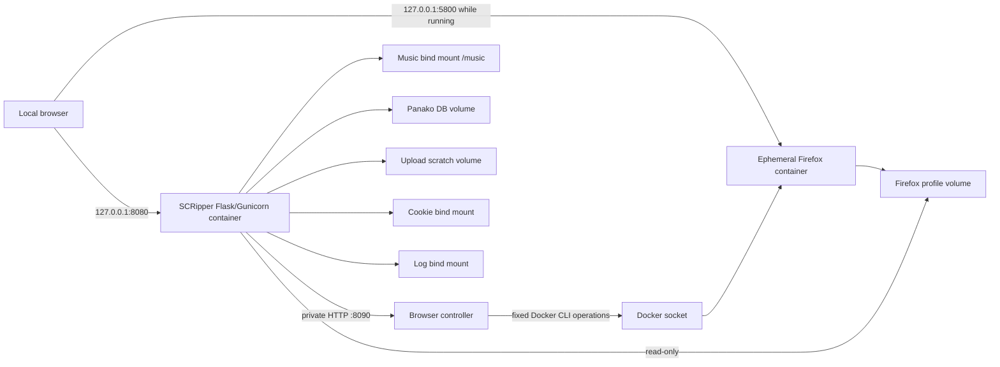

# SCRipper Suite engineering guide

## 1. System purpose

SCRipper Suite is a localhost-only, self-hosted DJ media application with two
related product surfaces:

- **SCRipper** resolves SoundCloud/YouTube URLs, downloads audio, converts it
  to 320 kbps MP3, embeds tags/artwork, and manages files in a mounted music
  library.
- **MixID** fingerprints that library with Panako, scans a recorded DJ mix,
  converts Panako segment matches into a timestamped tracklist, and augments
  matches with duration, BPM, tempo shift, played BPM, and musical key.

The system is deliberately local and single-user. It has no application login
and may operate with the user's streaming-service session cookies. It must not
be exposed as a public web service.

## 2. Runtime topology



There are normally two long-running Compose services:

1. `scripper` runs the web application and all media/fingerprint tools. It has
   no Docker socket.
2. `browser-controller` owns the Docker socket and provides a narrow private
   API for one fixed-purpose Firefox container.

Firefox is not a permanent Compose service. It is created only when the user
starts the login browser and is removed when stopped.

### Published ports

| Port | Binding | Purpose |
| --- | --- | --- |
| 8080 | `127.0.0.1:8080` | Main web application/API |
| 5800 | `127.0.0.1:5800` | Firefox web UI, only while Firefox runs |
| 8090 | Compose network only | Browser-controller API |

## 3. Application process model

The container command is:

```text
gunicorn --config gunicorn.conf.py app:app
```

Gunicorn uses:

- One worker process.
- The `gthread` worker class.
- Eight HTTP threads.
- A 300-second HTTP timeout and 30-second graceful timeout.

The single process is an architectural requirement in the current design, not
only a tuning choice. Job records, job queues, locks, worker threads, metadata
pending state, and the retained-mix pointer are process-local. Multiple
Gunicorn processes would create divergent job registries and queues.

Inside that process, the application starts three named background threads:

| Worker | Queue capacity | Work |
| --- | ---: | --- |
| `panako` | 8 | Library indexing and mix identification, serialized |
| `download` | 4 | Download jobs; each job uses up to three per-track threads |
| `metadata` | 1000 | Duration, BPM, and key cache warming |

HTTP threads enqueue work and poll job state; they do not perform the long
Panako/download workflows inline. Lightweight file-list, streaming, history,
and status routes are handled directly.

`WorkerRuntime` guarantees that each named worker starts at most once. It owns
a shared stop event, and its shutdown path joins workers with a bounded wait.
Gunicorn calls that path when its worker exits.

## 4. Initialization and application factory

Importing `app.py` performs process-level initialization:

1. `AppSettings.from_environment()` resolves runtime paths and controller
   configuration.
2. Upload, database, log, waveform-cache, and history directories are created.
3. A rotating file logger and stderr logger are configured.
4. Process-global services are created:
   - `JobService`
   - `MetadataStores`
   - `WorkerRuntime`
   - Manifest/history/mix locks
5. `ApplicationState` groups settings and those services.
6. `create_app()` creates Flask, sets the 4 GiB request limit, registers the
   declarative blueprint, attaches `ApplicationState`, starts workers when
   enabled, and performs startup cleanup.
7. A module-level WSGI application is created as `app`.

The factory creates an isolated Flask application and route map, but it
intentionally attaches the same process-global service objects. This supports
test clients and prevents duplicate route registration; it is not dependency
isolation between multiple application instances in one process.

All route definitions live in `web_routes.ROUTE_DEFINITIONS`. The blueprint
looks up handler functions in `app.py` and installs the origin check as a
`before_app_request` hook.

## 5. Source-module map

| Module | Engineering responsibility |
| --- | --- |
| `app.py` | Domain orchestration, request handlers, Panako workflows, metadata algorithms, cookie capture |
| `app_config.py` | Immutable environment-backed settings |
| `application_state.py` | Service object graph attached to Flask extensions |
| `web_routes.py` | Declarative URL/method-to-handler registration |
| `job_service.py` | Thread-safe jobs, logs, activity, and bounded queues |
| `job_state.py` | Pure terminal-job retention policy |
| `worker_runtime.py` | Worker start-once, shutdown, joining, and health |
| `fingerprint_manifest.py` | Versioned manifest parsing, signatures, staleness, and save |
| `track_identity.py` | Full-path match resolution and metadata cache keys |
| `metadata_store.py` | Locked persistent JSON caches for duration/BPM/key |
| `waveform.py` | Validation and streaming PCM-to-RMS aggregation |
| `process_utils.py` | Subprocess deadlines, bounded reader queues, process-tree termination |
| `download_service.py` | ffmpeg conversion, Mutagen tagging, friendly failure text |
| `safe_download.py` | Safe filenames and collision-free final publication |
| `safe_upload.py` | Exclusive-create stream copies |
| `state_storage.py` | Atomic JSON replacement and corrupt-file quarantine |
| `runtime_hygiene.py` | Age/count-bounded cleanup under validated roots |
| `request_validation.py` | API schemas, types, URL/path/folder validation, limits |
| `request_security.py` | Browser same-origin checks |
| `history_updates.py` | Validated manual-title mutation |
| `browser_controller.py` | Fixed-purpose Docker controller for Firefox |
| `gunicorn.conf.py` | Production WSGI/thread/timeout/shutdown configuration |
| `static/index.html` | Entire browser UI: HTML, CSS, and framework-free JavaScript |

## 6. Job model and concurrency

### Job record

A job is an in-memory dictionary with:

- `id`, `type`, and user-facing `label`.
- `status`: normally `queued`, `running`, `done`, or `error`.
- Optional `progress`, `detail`, `result`, and `error`.
- A bounded console `log` and an `active` per-file progress map.
- Creation, update, and completion timestamps.

All registry access is protected by one lock. Reads return copies of mutable
fields so Flask JSON serialization cannot race a writer.

Terminal jobs expire after 24 hours and only the newest 100 terminal records
are retained. Active records do not expire. The registry is not persisted; an
application restart invalidates job IDs even though completed scan history and
the Panako database survive.

### Submission and backpressure

`submit_job()` creates the record and performs `put_nowait()` on the selected
queue. If the queue is full, the record becomes terminal with an error and the
endpoint returns HTTP 429.

The queue split is important:

- Panako operations are serialized to protect its LMDB/single-writer model.
- Downloads can proceed independently of a multi-hour mix scan.
- Metadata analysis is best-effort background work and cannot extend the
  synchronous identification critical path.

### Worker failure behavior

The generic worker changes the job to `running`, invokes the domain function,
and catches any uncaught exception. An uncaught exception is logged and changes
the job to `error`; the worker thread itself continues processing later jobs.
Domain functions explicitly handle expected failures where they need resource
cleanup or a clearer error message.

## 7. SCRipper download workflow

### URL resolution

`POST /api/scripper/resolve` accepts a text field containing comma- or
newline-separated URLs.

1. The body must be a JSON object.
2. At most 25 input URLs are accepted.
3. URLs must be absolute HTTP/HTTPS URLs and no more than 4096 characters.
4. yt-dlp runs with `extract_flat` and without downloading.
5. A playlist expands to track URLs, which are validated again and capped at
   500.
6. The response identifies each input as a track, playlist, or error so the UI
   can ask the user to confirm the expanded set.

### Download execution

`POST /api/scripper/download` validates:

- A non-empty list of at most 500 URLs.
- Absolute HTTP/HTTPS URL syntax.
- A string destination folder with bounded length and filesystem-safe
  characters.
- A Boolean `index_after` flag.
- Destination containment under `/music` through real-path checking.

The endpoint queues a download job. The download worker then uses a
`ThreadPoolExecutor(max_workers=3)` for per-track concurrency.

For each URL:

1. Create a private `.scripper-download-*` directory inside the destination.
2. Configure yt-dlp to write an ID-derived source filename there.
3. Consult the destination's `.download_archive.txt` so previously downloaded
   URLs can be skipped.
4. Use the configured cookie file if one exists.
5. Convert the source to MP3 with ffmpeg at 320 kbps. `-n` prevents ffmpeg from
   replacing an existing output.
6. Use Mutagen to write title (`TIT2`), artist (`TPE1`), album (`TALB`), and
   optional cover art (`APIC`). Artwork is fetched with Requests and a
   10-second timeout; artwork failure does not fail the track.
7. Sanitize the title into a Windows-compatible filename.
8. Publish without overwriting:
   - Preferred: create a hard link from the finished private file to the final
     path. This is atomic and fails on collision.
   - Fallback: copy into an exclusively created final file on mounts that do
     not support hard links. This preserves no-overwrite semantics but a
     concurrent reader could observe the copy while it is in progress.
9. Allocate a numbered filename on collision.
10. Remove the private directory in all cases.

Progress hooks update the job's per-file activity map and bounded console log.
Platform errors are converted to user-oriented explanations for 404,
authorization, regional availability, rate limits, and private tracks.

If `index_after` is true and there was downloaded or archived content, the
download worker submits a separate Panako index job.

## 8. Library file operations

`safe_music_path()` joins a user-relative value to `/music`, resolves it with
`realpath`, and accepts it only when it is the root or remains below the root.
File-list, stream, download, waveform, zip, upload, folder-resolution, and
index routes all use this boundary.

### Upload

- Accepts supported audio extensions only.
- Sanitizes the basename.
- Caps one request at 500 tracks (and all Flask requests at 4 GiB).
- Opens the final destination with exclusive-create semantics.
- Reports existing names as conflicts.

### Browser playback and download

- `/api/stream` uses Flask conditional file serving, which supports Range
  requests and browser seeking.
- `/api/download` uses attachment disposition for one file.
- `/api/zip` creates a store-only ZIP in upload scratch space and registers a
  response-close callback to delete it.
- `/api/waveform` returns cached, normalized thumbnail peaks.

## 9. Panako index workflow

### Manifest invariants

The persisted manifest has this conceptual shape:

```json
{
  "version": 2,
  "files": {
    "/music/Set/Track.mp3": {
      "size": 12345678,
      "mtime_ns": 1784670000000000000
    }
  }
}
```

An entry is current only if both current filesystem values equal the saved
signature. Missing files, changed bytes/metadata that changes size or mtime,
legacy entries, malformed JSON, and a database-without-manifest condition all
prevent identification.

### Incremental index

When the manifest is fully current:

1. Enumerate audio files directly inside the selected folder.
2. Skip files already represented by a current signature.
3. Queue metadata warming for skipped current files.
4. Run `panako monitor` on each new candidate to detect a strong duplicate.
5. For non-duplicates, run `panako store STRATEGY=panako <path>`.
6. Record a signature only after a successful store.
7. Remove failed/duplicate candidates from the manifest.

### Consistency rebuild

When any manifest entry is stale or legacy, the index job combines still-valid
previous candidates with the selected folder and rebuilds the entire
application-owned Panako LMDB.

When the manifest is structurally invalid, it is quarantined and the rebuild
scans all supported library audio files. Before deleting LMDB, the code proves
that the target's real parent is the configured DB root and its basename is
exactly `panako_db`.

A pending manifest is saved before storing files. If the process stops midway,
those pending entries fail signature validation and force another safe rebuild.

## 10. Mix identification workflow

`POST /api/identify` follows this sequence:

1. Reject the request with 409 if the fingerprint manifest is invalid or
   stale.
2. Reject with 429 if the Panako queue is full.
3. Validate the uploaded extension and bound `min_segments` to 1–20.
4. Save the upload to a UUID-prefixed path in `/uploads`.
5. Queue the identification job on the serialized Panako queue.

The worker repeats the manifest check because the library may have changed
while the job waited. It then:

1. Uses ffprobe to obtain a finite, positive duration.
2. Rejects audio longer than eight hours.
3. Computes an overall deadline: `clamp(duration * 2, 600, 7200)` seconds.
4. Generates 700 waveform buckets first and publishes them into the job record
   so the UI can render while fingerprinting continues.
5. Starts `panako monitor STRATEGY=panako <mix>` in its own process group.
6. Streams result lines through a bounded queue with the remaining deadline.
7. Parses query offsets, source reference, match position, score, and Panako
   time factor; query offsets include Panako segment offsets.
8. Updates job progress from monitor segment names.
9. Rechecks the manifest after Panako exits.
10. Collapses accepted segment runs into tracklist entries.
11. Queues background metadata warming for references found in the monitor
    output.
12. Atomically saves history and completes the job.

Timeouts or failures terminate the Panako process group and remove the failed
mix. A successful scan registers the upload as the one retained mix for Range
streaming and timestamped slice playback; the previous retained mix is removed.

### Match collapse

Matches are sorted by query start and contiguous matches for the same full
source reference are combined. Runs below `min_segments` are discarded.

For each accepted run:

- Average Panako time factor becomes the tempo-shift percentage.
- Source BPM multiplied by time factor becomes played BPM.
- Near-integer played BPM is snapped for cleaner DJ-facing output.
- Remaining source-track duration estimates how far the track likely continues
  after its last confident fingerprint segment.
- Gaps longer than 40 seconds become unidentified placeholders only when they
  are not covered by that expected continuation.
- Key/duration/BPM reads use only already-cached values in this synchronous
  phase.

This continuation rule reduces false unidentified gaps during transitions,
loops, effects, or blends where fingerprint confidence temporarily falls.

## 11. Metadata analysis

All metadata stores are keyed by a JSON-encoded tuple of:

```text
[library-relative path, file size, mtime_ns]
```

This makes same-named tracks independent and automatically invalidates cached
analysis after replacement.

### Duration

Duration comes from `ffprobe` and is persisted in `duration_cache_v1.json`.

### BPM

1. Prefer an existing Mutagen-readable `TBPM` tag.
2. Otherwise decode a bounded mono WAV analysis window with ffmpeg.
3. Ask aubio for beat timestamps.
4. Find the longest stable inter-beat-interval run and fit tempo over its full
   span.
5. Fall back to `aubio tempo` when fewer than 12 beats are available.
6. Fold values into the normal 60–190 DJ range, reject implausible results,
   and snap detector output to credible integer/half values.

Results are persisted in `bpm_cache_v3.json`.

### Musical key

1. Prefer an existing `TKEY` tag.
2. Otherwise use ffmpeg to decode a bounded float32 mono window that skips a
   long track's intro.
3. Run Essentia `KeyExtractor(profileType="edmm")`.
4. Normalize selected sharp names to flats and append `m` for minor.

Results are persisted in `key_cache_v3.json`.

The cache stores `None` as a real result. The `MISSING` sentinel prevents a
failed/undetectable file from being analyzed on every request.

## 12. Waveform implementation

Waveforms use ffmpeg to decode mono signed 16-bit PCM at 8 kHz to stdout.
`iter_chunks_with_deadline()` reads at most 64 KiB per chunk through a queue of
16 chunks. `aggregate_pcm()` maps samples into a fixed number of buckets and
combines chunk RMS values as a weighted sum of squares.

The final values are normalized by the largest bucket and transformed with a
power of 0.7 to improve visual contrast. Values are rounded to three decimal
places.

Library waveform cache keys are SHA-1 digests of path, modification time,
bucket count, and an algorithm-version string. SHA-1 is used only as a compact
cache-key function; it is not a security primitive here.

Startup cleanup retains at most 5000 waveform JSON files and removes entries
older than 90 days.

## 13. History and persistent state

### Scan history

Each completed scan stores one JSON file containing ID, mix name, timestamp,
duration, tracklist, and waveform. The newest 50 are retained.

Recalled history is view-only because only the latest successful mix audio is
retained. Users may assign a manual title to unidentified regions; mutation is
located by a finite numeric start timestamp and only applies to an unidentified
entry.

### Atomic JSON protocol

General caches and history use this protocol:

1. Create a unique temporary file in the destination directory.
2. Serialize JSON.
3. Flush and fsync the file.
4. Atomically replace the destination with `os.replace`.
5. Fsync the directory on POSIX.
6. Remove any leftover temporary file on failure.

Malformed JSON is renamed with an `.invalid-<time_ns>` suffix before a default
value is returned. This preserves forensic evidence and avoids overwriting the
only copy of corrupt state.

The fingerprint manifest has a separate, lock-protected atomic save helper
using a fixed `.tmp` sibling. Manifest writes are serialized by the manifest
lock.

### Persistence inventory

| Data | Location | Lifetime |
| --- | --- | --- |
| Panako LMDB and manifest | `panako-db` volume | Persistent across rebuilds |
| Duration/BPM/key caches | Panako DB volume | Persistent, signature-invalidated |
| Waveform cache | Panako DB volume | Persistent, bounded by age/count |
| Scan history | Panako DB volume | Persistent, newest 50 |
| Uploaded/retained mix | `mixid-uploads` volume | Scratch; newest successful mix retained |
| Download archive | Each destination folder | Persistent with music library |
| Download working dirs | Destination folder | Ephemeral; one-day startup cleanup |
| Cookies | `./cookies` bind mount | Persistent credential material |
| Firefox profile | Named Docker volume | Persistent login-browser profile |
| Debug log | `./logs/scripper.log` | Rotating, three backups of 5 MiB |
| Jobs/current mix pointer | Process memory | Lost on restart |

## 14. Login browser and cookie capture

The main application calls the controller's `/start`, `/stop`, and `/status`
routes. The controller does not accept an image name, container name, port,
volume, command, or Docker flag from the application request.

### Controller ownership rule

The managed container name is fixed as `scripper-login-browser`. The controller
adds `com.scripper.login-browser=true` and checks that label on every existing
same-named container. If the label is missing, the controller refuses to stop,
remove, or replace it.

Firefox is launched with:

- A digest-pinned image supplied by Compose.
- Port 5800 bound to loopback only.
- The fixed `scripper-firefox-profile` volume.
- SoundCloud as the initial URL.
- Optional VNC password from `LOGIN_BROWSER_PASSWORD`.
- A 1 GiB shared-memory allocation.

### Cookie capture

Firefox keeps its SQLite cookie database open and may use WAL files. The app
copies `cookies.sqlite`, `cookies.sqlite-wal`, and `cookies.sqlite-shm` to a
temporary directory and queries the copy. It exports only relevant domains in
Netscape cookie-file format and creates the destination with mode `0600`.

The user can alternatively upload a Netscape-format file through the API or
run `dump_cookies.py` on the Windows host with `browser_cookie3`.

## 15. Request and trust boundaries

### Network scope

- Compose binds the application and Firefox only to loopback.
- The browser controller is private to the Compose network.
- The application has no authentication and must not be exposed publicly.

### Browser request checks

Every Flask request first checks that `Host` is one of the configured loopback
forms. If browser provenance headers are present, `Origin` and `Referer` must
match the request scheme/host exactly and `Sec-Fetch-Site` must be
`same-origin` or `none`.

These checks mitigate browser-driven cross-origin API use and DNS rebinding.
They are not a substitute for authentication on a non-loopback deployment.

### Filesystem scope

- Music paths are constrained with `realpath` containment.
- Panako database reset validates an exact application-owned path.
- Cleanup skips symlinks and validates deletion roots.
- User-library files use exclusive-create/no-overwrite operations.
- Cookie material is owner-only and excluded from Git/Docker build context.

### Docker trust

The controller remains host-trusted because Docker socket access is equivalent
to host control. The design reduces the exposed interface and isolates media
parsers from the socket; it does not make the controller untrusted or sandbox
the Docker daemon.

### Runtime identity

The application entrypoint adjusts managed-volume ownership as root, leaves
the user-owned `/music` bind mount untouched, and uses `gosu` to execute the
application and media tools as `scripper`. `PUID` and `PGID` allow Linux users
to align that identity with host filesystem ownership.

## 16. HTTP API map

| Method | Route | Purpose |
| --- | --- | --- |
| GET | `/` | Serve the single-page UI |
| GET | `/api/health` | Lightweight process liveness |
| GET | `/api/ready` | Worker/storage/Panako readiness and queue depths |
| GET | `/api/job/<jid>` | Poll an in-memory job |
| GET | `/api/folders` | List top-level music folders |
| POST | `/api/resolve-folder` | Find matching folder names under music root |
| POST | `/api/index` | Queue a Panako index/rebuild job |
| POST | `/api/identify` | Upload and queue a mix scan |
| GET | `/api/library` | Indexed library summary and stale count |
| GET | `/api/mix-stream` | Range-stream latest retained mix |
| DELETE | `/api/mix` | Remove latest retained mix |
| GET | `/api/history` | List scan summaries |
| GET/PATCH/DELETE | `/api/history/<hid>` | Recall, rename unidentified entry, or delete scan |
| GET | `/api/files` | List supported audio in a folder |
| GET | `/api/stream` | Range-stream a library track |
| GET | `/api/download` | Download one library track |
| GET | `/api/zip` | Download a folder as a store-only ZIP |
| POST | `/api/upload-tracks` | Add files without overwriting |
| GET | `/api/waveform` | Get cached waveform peaks |
| POST | `/api/scripper/resolve` | Resolve tracks/playlists through yt-dlp |
| POST | `/api/scripper/download` | Queue a download job |
| GET/POST/DELETE | `/api/cookies` | Status, upload, or delete cookie file |
| POST | `/api/cookies/capture` | Capture Firefox cookies and stop Firefox |
| POST | `/api/login-browser/start` | Start managed Firefox |
| POST | `/api/login-browser/stop` | Stop managed Firefox |
| GET | `/api/login-browser/status` | Query managed Firefox |

## 17. Frontend architecture

The frontend is a single static file with no framework or build step. It uses:

- Semantic HTML and CSS custom properties.
- The Fetch API for backend calls.
- `FormData` for mix, track, and cookie uploads.
- `AbortController` for cancellable job polling.
- `<audio>` plus HTTP Range requests for playback/seeking.
- Canvas 2D for mix/library/player waveforms and the visualizer.
- Web Audio `AudioContext`/analyser data for the reactive 3D ridge display.
- `requestAnimationFrame` for playback markers and visualization.
- `matchMedia("(prefers-reduced-motion: reduce)")` to disable motion-heavy
  rendering.

### Polling model

`pollJob()` maintains one in-flight request. A new poll cancels the previous
one. Successful nonterminal responses schedule the next request with
`setTimeout`; transient failures use exponential backoff and terminate after
five failures. This avoids request overlap when a slow response takes longer
than the nominal interval.

### Accessibility model

- Tabs use tablist/tab/tabpanel roles and roving focus.
- Status messages and the job console use live-region roles.
- Drop targets and folder rows have keyboard equivalents.
- Dynamic icon controls receive contextual accessible names.
- The canvas seek bar is a keyboard-operable ARIA slider.
- Reduced-motion mode stops visualization animation while ordinary media
  events continue updating elapsed time and slider values.

### DOM safety

Dynamic select options are created with DOM nodes and `.textContent`/`.value`.
Other user/platform text is inserted through text nodes or escaped before
limited template use. This is particularly important because track names,
folder names, and yt-dlp metadata are external input.

## 18. Build and dependency model

### Application image stages

1. **`panako-builder`** installs Git, compiler tools, libc headers, and a full
   JDK. It builds LMDB and JGaborator and runs Panako's Gradle build.
2. **`runtime-base`** installs the JRE, ffmpeg/ffprobe, gosu, Python 3.9/pip,
   aubio tools, certificates, and the C++ runtime. It copies only built native
   artifacts and the Panako installation.
3. **`test`** adds Ruff and test/build-policy fixtures, then runs lint, format,
   unittest, and native media smoke tests.
4. **`runtime`** is the default deployable image and contains no test or
   compiler tooling.

The base image is digest-pinned. Native projects are fetched at full commit
IDs. The Gradle 7.2 distribution has a configured SHA-256. Python packages are
installed with `pip --require-hashes` from exact locks.

The current dependency hashes and native wheels were validated for the
`linux/amd64` Docker build used during this session. Supporting another
architecture may require additional package hashes or a different Essentia
artifact.

### Major runtime tools and libraries

| Tool/library | Role |
| --- | --- |
| Python 3.9 | Application runtime |
| Flask | HTTP routing, request parsing, JSON, file responses |
| Gunicorn | Production WSGI process and HTTP thread management |
| yt-dlp | Track/playlist extraction and source download |
| ffmpeg | Audio conversion and PCM/key/BPM analysis decoding |
| ffprobe | Duration measurement |
| Panako | Acoustic fingerprint storage, duplicate detection, mix monitoring |
| LMDB | Panako fingerprint database |
| JGaborator | Panako native spectral transform dependency |
| Java/JRE | Panako runtime |
| Gradle | Panako build only |
| aubio | Beat timestamps and fallback tempo estimation |
| Essentia | EDM-profile musical-key extraction |
| NumPy | Float32 PCM view passed to Essentia |
| Mutagen | MP3 ID3 writes and existing BPM/key tag reads |
| Requests | Artwork download and controller HTTP calls |
| SQLite (stdlib) | Reading copied Firefox cookie data |
| gosu | Drop privileges after volume preparation |
| Docker Compose | Service, volume, port, health, and restart orchestration |
| Docker CLI | Controller's fixed Firefox lifecycle operations |
| jlesage/firefox | Browser-accessible Firefox login environment |

### Development and verification tools

| Tool | Role |
| --- | --- |
| Ruff | Import sorting, selected lint rules, and formatting |
| `unittest` | Unit and Flask integration tests |
| Docker BuildKit/buildx | Dockerfile policy checks and multi-stage builds |
| Node.js | Optional direct parse check for the inline frontend JavaScript |
| PowerShell/POSIX shell | Equivalent release-gate entry points |

## 19. Configuration

### Application environment

| Variable | Default | Purpose |
| --- | --- | --- |
| `SCRIPPER_MUSIC_ROOT` | `/music` | Library root |
| `SCRIPPER_UPLOAD_DIR` | `/uploads` | Mix/ZIP/analysis scratch |
| `SCRIPPER_DB_DIR` | `~/.panako/dbs` | Manifest, LMDB, history, caches |
| `SCRIPPER_LOG_DIR` | `/logs` | Rotating application log |
| `SCRIPPER_COOKIE_FILE` | `/cookies/cookies.txt` | yt-dlp cookie file |
| `SCRIPPER_BROWSER_PROFILE_DIR` | `/browser-profile` | Read-only Firefox profile mount |
| `BROWSER_CONTROLLER_URL` | `http://browser-controller:8090` | Private controller base URL |
| `SCRIPPER_START_WORKERS` | `1` | Set `0` for isolated tests/tools |

### Compose/user configuration

| Variable | Default | Purpose |
| --- | --- | --- |
| `MUSIC_DIR` | Parent of `mixid_app` | Host music bind mount |
| `PUID` | `1000` | Runtime UID on Linux |
| `PGID` | `1000` | Runtime GID on Linux |
| `LOGIN_BROWSER_PASSWORD` | Empty | Optional Firefox/VNC password |

## 20. Health, logging, and operations

`GET /api/health` reports only that the Flask process can answer requests. It
does not touch the manifest, queues, or media tools and is used for Docker
liveness.

`GET /api/ready` verifies:

- All expected background workers are alive (unless workers were explicitly
  disabled).
- Upload, database, and log directories exist and are writable.
- The Panako executable is on `PATH`.
- Queue depths are included for diagnosis.

It returns 503 when any required condition fails.

The application writes to stderr and `/logs/scripper.log`. The file rotates at
5 MiB with three backups. Job logs are also available through the job API but
are bounded and ephemeral.

The recommended full verification command is:

```powershell
.\scripts\ci.ps1
```

or:

```bash
sh scripts/ci.sh
```

It checks Compose and both Dockerfiles, builds the isolated test target, runs
all tests inside it, and builds both deployable images.

## 21. Test architecture

The test suite is based on Python `unittest` and currently contains 62 tests.

- Pure unit tests cover manifests, atomic state, retention, workers, process
  deadlines, waveform aggregation, identity resolution, validation, history,
  upload/download publication, controller policy, and frontend/static build
  contracts.
- Flask integration tests create temporary roots, disable background workers,
  instantiate a test client, and verify response/status behavior and important
  race guards.
- Container-only smoke tests load `/lib/liblmdb.so`, generate 30 seconds of
  synthetic audio with ffmpeg, verify duration with ffprobe, and run Panako's
  `same` operation.
- Static build tests enforce image digests, source commit pins, Gradle checksum,
  hashed Python requirements, absence of compiler packages in the runtime
  stage, health/Gunicorn configuration, Compose socket isolation, and release
  gate coverage.

The Docker test stage is important because it tests the exact files copied into
the Linux artifact, including native libraries. A Windows bind-mounted test run
alone is not treated as sufficient.

## 22. Architectural constraints and failure semantics

- **Single process:** Scaling Gunicorn workers above one is unsafe until jobs,
  queue ownership, retained-mix identity, and locks move to shared external
  services.
- **Ephemeral jobs:** Restarting the application loses job status. Durable scan
  history remains, but clients polling old job IDs receive 404.
- **Serialized fingerprint work:** A long identification delays later index or
  identification jobs by design. Deadlines bound that delay.
- **Best-effort metadata:** Missing BPM/key/duration does not fail
  identification; a tracklist may initially contain null metadata while
  background warming proceeds.
- **Manifest safety over availability:** Any state that cannot prove the LMDB
  matches current files blocks identification and requires a rebuild.
- **Latest mix only:** History preserves tracklists and waveforms, not every mix
  audio file.
- **No authentication:** Host/origin checks and loopback binding are local
  protections, not a public deployment security model.
- **Controller trust:** The narrow controller API limits accidental exposure,
  but compromise of that container still implies Docker-host control.
- **Download fallback visibility:** Exclusive-copy fallback never overwrites a
  file but is not as atomically visible as hard-link publication.
- **Architecture-specific artifacts:** The current pinned binary dependency set
  is validated for the build architecture used in this session.

These constraints explain several otherwise unusual choices: one Gunicorn
process with multiple HTTP threads, three in-process worker threads, strict
manifest rebuild behavior, a dedicated Docker controller, and extensive
backpressure rather than horizontal scaling.
